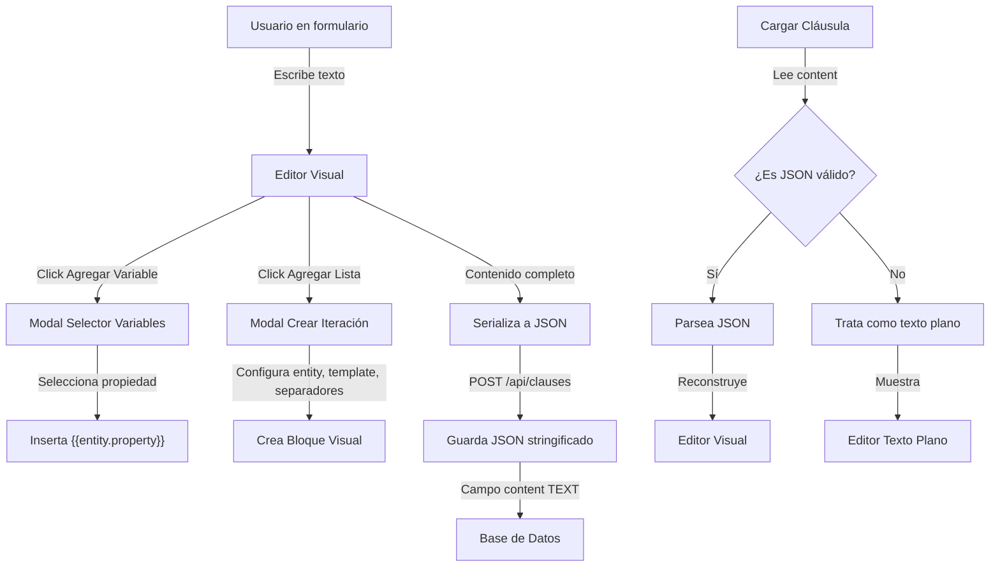

# Implementation Plan: Editor Visual para Contenido Estructurado de Cláusulas

**Date**: 2025-01-21  
**Spec**: [specs/clause-structured-content/clause-structured-content-spec.md](specs/clause-structured-content/clause-structured-content-spec.md)

## Summary

Implementar un editor visual para crear contenido estructurado de cláusulas que permite a usuarios no técnicos insertar variables simples y bloques de iteración mediante una interfaz gráfica intuitiva, sin necesidad de escribir sintaxis manual. El contenido se almacena como JSON stringificado en el campo `content` existente, manteniendo compatibilidad hacia atrás con cláusulas en formato texto plano.

## Architecture



## Technical Context

**Language/Version**: TypeScript 5.x / Node.js  
**Primary Dependencies**:

- Next.js 16.0.7 (App Router)
- React 19.2.0
- Drizzle ORM 0.45.1
- PostgreSQL (pg 8.16.3)
- Better Auth 1.4.7 (para autenticación y permisos)
- shadcn/ui (para componentes UI)
- Radix UI (para Dialog, DropdownMenu components)

**Storage**: PostgreSQL (campo `content` TEXT - JSON stringificado)  
**Testing**: Manual testing basado en escenarios de aceptación  
**Target Platform**: Web (Next.js App Router)  
**Project Type**: Web application (Next.js monorepo)  
**Performance Goals**:

- Editor renderizado en <500ms (95th percentile)
- Inserción de variable/iteración sin lag perceptible (<100ms)
- Serialización a JSON en <50ms
- Parseo de JSON al cargar en <100ms

**Constraints**:

- Mantener compatibilidad hacia atrás con contenido texto plano
- El campo `content` permanece como TEXT (no cambiar a JSONB)
- Validación estricta de entidades y propiedades (solo permitir las predefinidas)
- No permitir escribir sintaxis manualmente en modo estructurado
- Máximo 50,000 caracteres en content (incluye JSON stringificado)

**Scale/Scope**:

- Múltiples usuarios pueden crear cláusulas estructuradas
- Editor debe manejar contenido con múltiples iteraciones y variables
- Sistema debe detectar formato (estructurado vs texto plano) al cargar

## Project Structure

### Documentation

```
specs/clause-structured-content/
├── clause-structured-content-plan.md    # Este archivo
└── clause-structured-content-spec.md    # Especificación de la feature
```

### Source Code

```
src/
├── lib/
│   └── clauses/
│       ├── constants.ts                 # Extender con entidades y propiedades
│       ├── structured-content/
│       │   ├── types.ts                 # Tipos TypeScript para contenido estructurado
│       │   ├── parser.ts                # Funciones para parsear JSON a estructura
│       │   ├── serializer.ts            # Funciones para serializar estructura a JSON
│       │   ├── validator.ts             # Validación de contenido estructurado
│       │   └── renderer.ts              # Renderer para convertir a texto final (futuro)
│       └── entity-definitions.ts        # Definiciones de entidades y propiedades
├── components/
│   ├── clauses/
│   │   ├── create-clause-form.tsx       # Modificar para usar editor visual
│   │   └── structured-content-editor/
│   │       ├── clause-content-editor.tsx        # Componente principal del editor
│   │       ├── iteration-block.tsx              # Componente para bloques de iteración
│   │       ├── variable-chip.tsx                # Componente para variables simples
│   │       ├── add-variable-modal.tsx           # Modal para agregar variables
│   │       ├── add-iteration-modal.tsx          # Modal para crear iteraciones
│   │       └── property-autocomplete.tsx        # Autocomplete para propiedades
│   └── ui/
│       └── dialog.tsx                   # Agregar componente Dialog de shadcn/ui (si no existe)
```

## Phase 1: Constants and Type Definitions - Priority: P1

**Goal**: Definir las constantes de entidades/propiedades y los tipos TypeScript para el contenido estructurado. Esta fase es fundamental porque todas las demás fases dependen de estas definiciones.

**Independent Test**: Verificar que los tipos y constantes se pueden importar correctamente y que las definiciones son consistentes.

### Implementation

- [ ] **T001 [P1] [US4]** Extender [`src/lib/clauses/constants.ts`](src/lib/clauses/constants.ts) con nuevas constantes:

  - Agregar exportaciones para entidades disponibles: `AVAILABLE_ENTITIES = ["propietarios", "inquilinos"] as const`
  - Agregar tipo `AvailableEntity` para TypeScript

- [ ] **T002 [P1] [US4]** Crear archivo [`src/lib/clauses/entity-definitions.ts`](src/lib/clauses/entity-definitions.ts):

  - Definir objeto `ENTITY_PROPERTIES` que mapea cada entidad a sus propiedades:
    - `propietario`: { nombre: "Nombre", dni: "DNI", domicilio: "Domicilio" }
    - `inquilino`: { nombre: "Nombre", dni: "DNI", domicilio: "Domicilio" }
    - `propiedad`: { direccion: "Dirección", ambientes: "Ambientes", superficie: "Superficie" }
  - Función `getEntityProperties(entity: string)` que retorna las propiedades de una entidad
  - Función `isValidEntity(entity: string): boolean`
  - Función `isValidProperty(entity: string, property: string): boolean`

- [ ] **T003 [P1] [US4]** Crear archivo [`src/lib/clauses/structured-content/types.ts`](src/lib/clauses/structured-content/types.ts):

  - Tipo `ContentPartType = "text" | "variable" | "iteration"`
  - Tipo `TextPart = { type: "text", content: string }`
  - Tipo `VariablePart = { type: "variable", path: string }` (path = "entity.property")
  - Tipo `IterationPart = { type: "iteration", entity: "propietarios" | "inquilinos", template: string, separator: string, lastSeparator: string, addPeriod: boolean }`
  - Tipo `ContentPart = TextPart | VariablePart | IterationPart`
  - Tipo `StructuredContent = { type: "structured", parts: ContentPart[] }`
  - Tipo guard functions: `isTextPart`, `isVariablePart`, `isIterationPart`

**Checkpoint**: Tipos y constantes definidos. Todas las funciones de validación básicas funcionan correctamente.

---

## Phase 2: Parser and Serializer Utilities - Priority: P1

**Goal**: Implementar funciones para convertir entre JSON stringificado y estructura TypeScript, y para detectar el formato del contenido (estructurado vs texto plano).

**Independent Test**: Crear un objeto StructuredContent, serializarlo a JSON string, parsearlo de vuelta, y verificar que la estructura es idéntica. Probar con contenido texto plano para verificar que se detecta correctamente.

### Implementation

- [ ] **T004 [P1] [US4]** Crear archivo [`src/lib/clauses/structured-content/serializer.ts`](src/lib/clauses/structured-content/serializer.ts):

  - Función `serializeStructuredContent(content: StructuredContent): string`
    - Convierte StructuredContent a JSON string usando `JSON.stringify`
    - Maneja errores y lanza excepción descriptiva si falla

- [ ] **T005 [P1] [US4]** Crear archivo [`src/lib/clauses/structured-content/parser.ts`](src/lib/clauses/structured-content/parser.ts):

  - Función `parseStructuredContent(jsonString: string): StructuredContent | null`
    - Intenta parsear JSON string a StructuredContent
    - Valida que tenga estructura esperada (type: "structured", parts array)
    - Retorna `null` si no es válido (para detectar texto plano)
  - Función `isStructuredContent(content: string): boolean`
    - Intenta parsear el JSON
    - Verifica que tenga `type === "structured"` y `parts` array
    - Retorna `false` si no es JSON válido o no tiene estructura esperada
  - Función `parseContentParts(parts: unknown[]): ContentPart[]`
    - Valida y parsea cada part según su tipo
    - Usa type guards para determinar el tipo
    - Filtra o maneja parts inválidos apropiadamente

- [ ] **T006 [P1] [US4]** Crear archivo [`src/lib/clauses/structured-content/validator.ts`](src/lib/clauses/structured-content/validator.ts):

  - Función `validateStructuredContent(content: StructuredContent): { valid: boolean, errors: string[] }`
    - Valida que todas las entidades en iterations sean válidas
    - Valida que todas las propiedades en variables sean válidas (usar funciones de entity-definitions.ts)
    - Valida que los templates de iteración no estén vacíos
    - Retorna array de errores si hay problemas
  - Función `validateVariablePath(path: string): boolean`
    - Valida formato "entity.property"
    - Verifica que entity y property existan usando entity-definitions.ts

**Checkpoint**: Parser y serializer funcionan correctamente. La detección de formato texto plano vs estructurado es confiable.

---

## Phase 3: UI Components - Dialog and Base Components - Priority: P1

**Goal**: Agregar el componente Dialog de shadcn/ui (si no existe) y crear los componentes base para el editor visual.

**Independent Test**: Verificar que Dialog se puede importar y usar. Renderizar componentes base sin funcionalidad completa para verificar estilos.

### Implementation

- [ ] **T007 [P1] [US1,US2]** Agregar componente [`src/components/ui/dialog.tsx`](src/components/ui/dialog.tsx):

  - Usar shadcn/ui Dialog component (si no existe)
  - O agregar usando: `npx shadcn@latest add dialog`
  - Verificar que se puede importar y usar en modales

- [ ] **T008 [P1] [US2]** Crear componente [`src/components/clauses/structured-content-editor/variable-chip.tsx`](src/components/clauses/structured-content-editor/variable-chip.tsx):

  - Componente que muestra una variable como chip/badge
  - Props: `path: string` (ej: "propiedad.direccion"), `onClick?: () => void` (para editar/eliminar)
  - Estilos: fondo diferenciado, borde, padding
  - Muestra el path de forma legible (ej: "Propiedad: Dirección")

- [ ] **T009 [P1] [US2]** Crear componente [`src/components/clauses/structured-content-editor/iteration-block.tsx`](src/components/clauses/structured-content-editor/iteration-block.tsx):

  - Componente que muestra un bloque de iteración como card/box
  - Props: `iteration: IterationPart`, `onEdit: () => void`, `onDelete: () => void`
  - Estilos: borde, padding, fondo diferenciado
  - Muestra: entidad (ej: "Iteración sobre Propietarios"), preview del template
  - Botones: editar (ícono) y eliminar (ícono) en la esquina superior derecha

**Checkpoint**: Componentes base renderizan correctamente con estilos apropiados. Dialog está disponible para usar en modales.

---

## Phase 4: Modal Components - Priority: P1

**Goal**: Crear los modales para insertar variables y crear bloques de iteración.

**Independent Test**: Abrir modales, completar formularios, y verificar que se llaman callbacks correctamente con los datos ingresados.

### Implementation

- [ ] **T010 [P1] [US1]** Crear componente [`src/components/clauses/structured-content-editor/add-variable-modal.tsx`](src/components/clauses/structured-content-editor/add-variable-modal.tsx):

  - Modal usando Dialog component
  - Props: `open: boolean`, `onOpenChange: (open: boolean) => void`, `onSelect: (path: string) => void`
  - Muestra propiedades agrupadas por entidad (Propietario, Inquilino, Propiedad)
  - Usar Select o grupos de botones para seleccionar
  - Al seleccionar, llama `onSelect` con el path (ej: "propiedad.direccion") y cierra el modal
  - Botón cancelar cierra sin seleccionar

- [ ] **T011 [P1] [US2]** Crear componente [`src/components/clauses/structured-content-editor/property-autocomplete.tsx`](src/components/clauses/structured-content-editor/property-autocomplete.tsx):

  - Componente de autocomplete para propiedades dentro del template de iteración
  - Props: `entity: string`, `value: string`, `onChange: (value: string) => void`
  - Detecta cuando usuario escribe `{{` y muestra dropdown con propiedades disponibles
  - Al seleccionar, inserta `{{property}}` en la posición correcta
  - Puede usar Input component con lista desplegable o componente personalizado

- [ ] **T012 [P1] [US2]** Crear componente [`src/components/clauses/structured-content-editor/add-iteration-modal.tsx`](src/components/clauses/structured-content-editor/add-iteration-modal.tsx):

  - Modal usando Dialog component
  - Props: `open: boolean`, `onOpenChange: (open: boolean) => void`, `onCreate: (iteration: IterationPart) => void`, `initialData?: IterationPart` (para edición)
  - Campos:
    - Select para entidad (Propietarios, Inquilinos) - requerido
    - Textarea para template - requerido, con PropertyAutocomplete integrado
    - Input para separador (default: ", ")
    - Input para separador final (default: " y ")
    - Checkbox para agregar punto final (default: true)
  - Validación: entidad requerida, template no vacío
  - Botones: "Aplicar" (crea el bloque) y "Cancelar"
  - Si `initialData` está presente, prellenar campos (para edición)

**Checkpoint**: Modales funcionan correctamente. Los datos se capturan y se pasan mediante callbacks apropiadamente.

---

## Phase 5: Main Editor Component - Priority: P1

**Goal**: Crear el componente principal del editor que maneja el estado del contenido estructurado y renderiza todos los elementos.

**Independent Test**: Renderizar editor, insertar texto, agregar variables, crear iteraciones, y verificar que el estado interno se actualiza correctamente.

### Implementation

- [ ] **T013 [P1] [US1,US2,US3,US4]** Crear componente [`src/components/clauses/structured-content-editor/clause-content-editor.tsx`](src/components/clauses/structured-content-editor/clause-content-editor.tsx):

  - Props principales:
    - `value: StructuredContent` (estado actual)
    - `onChange: (content: StructuredContent) => void` (callback cuando cambia)
    - `disabled?: boolean`
  - Estado interno:
    - Maneja array de `ContentPart[]`
    - Maneja posición del cursor para insertar nuevos elementos
  - Funcionalidades:
    - Renderiza cada part según su tipo (text, variable, iteration)
    - Para text parts: input/textarea editable para texto normal
    - Para variable parts: renderiza VariableChip
    - Para iteration parts: renderiza IterationBlock
    - Botones: "Agregar Variable" y "Agregar Lista"
    - Al hacer click en botones, abre modales correspondientes
    - Cuando se inserta variable: agrega VariablePart al array en posición correcta
    - Cuando se crea iteración: agrega IterationPart al array en posición correcta
    - Cuando se edita iteración: actualiza el IterationPart correspondiente
    - Cuando se elimina iteración: remueve el IterationPart del array
    - Cuando se edita texto: actualiza el TextPart correspondiente
  - Layout: flexbox o grid para organizar elementos inline
  - Maneja focus y cursor apropiadamente

- [ ] **T014 [P1] [US3]** Implementar lógica de inserción de elementos:

  - Función `insertVariableAtCursor(path: string)`: inserta VariablePart después del part actual
  - Función `insertIterationAtCursor(iteration: IterationPart)`: inserta IterationPart después del part actual
  - Función `updateTextPart(index: number, newContent: string)`: actualiza contenido de TextPart
  - Función `deletePart(index: number)`: elimina un part del array

**Checkpoint**: Editor principal funciona. Se pueden insertar y editar variables e iteraciones. El estado se mantiene correctamente.

---

## Phase 6: Integration with Create Clause Form - Priority: P1

**Goal**: Integrar el editor visual con el formulario de creación de cláusulas existente, manteniendo compatibilidad con el modo texto plano.

**Independent Test**: Crear cláusula con editor visual, guardarla, verificar que se guarda como JSON en BD. Probar que cláusulas texto plano existentes siguen funcionando.

### Implementation

- [ ] **T015 [P1] [US4]** Modificar [`src/components/clauses/create-clause-form.tsx`](src/components/clauses/create-clause-form.tsx):

  - Agregar estado para modo de edición: `contentMode: "plain" | "structured"`
  - Agregar toggle o selector para cambiar entre modos (opcional en esta fase, puede ser siempre estructurado)
  - Reemplazar Textarea del campo content con ClauseContentEditor cuando está en modo estructurado
  - Mantener Textarea para modo texto plano (compatibilidad)
  - Al guardar en modo estructurado:
    - Convertir StructuredContent a JSON string usando `serializeStructuredContent`
    - Enviar JSON string en campo `content` al API (igual que antes)
  - Validación: usar `validateStructuredContent` antes de guardar si está en modo estructurado
  - Manejo de errores: mostrar errores de validación si el contenido estructurado es inválido

- [ ] **T016 [P1] [US4]** Actualizar [`src/app/api/clauses/route.ts`](src/app/api/clauses/route.ts) si es necesario:

  - Verificar que acepta JSON stringificado en campo `content` (ya debería funcionar)
  - No requiere cambios significativos ya que `content` es TEXT y acepta cualquier string
  - Opcional: agregar validación básica para detectar si es JSON válido (pero no requerir estructura específica para mantener compatibilidad)

- [ ] **T017 [P1] [US4]** Implementar detección de formato al cargar (para futura edición):

  - Crear función helper `detectContentFormat(content: string): "plain" | "structured"`
  - Usar `isStructuredContent` de parser.ts
  - Guardar en estado para determinar qué editor mostrar

**Checkpoint**: Editor visual integrado con formulario. Las cláusulas se guardan correctamente como JSON. Compatibilidad con texto plano mantenida.

---

## Phase 7: Polish and Edge Cases - Priority: P2

**Goal**: Mejorar UX, manejar edge cases, y agregar validaciones adicionales.

**Independent Test**: Probar casos límite: contenido vacío, múltiples iteraciones, textos largos, etc.

### Implementation

- [ ] **T018 [P2] [US3]** Mejorar visualización del editor:

  - Mejorar estilos de VariableChip y IterationBlock para mejor diferenciación
  - Agregar hover states y transiciones
  - Mejorar layout para elementos inline (texto y variables en la misma línea)
  - Agregar separadores visuales entre bloques de iteración

- [ ] **T019 [P2] [US2]** Mejorar autocomplete de propiedades:

  - Mejorar detección de `{{` en template
  - Mejorar posicionamiento del dropdown
  - Agregar navegación con teclado (arrow keys, enter)
  - Mostrar descripción de propiedades en el dropdown

- [ ] **T020 [P2] [US4]** Agregar validaciones adicionales:

  - Validar que no se exceda MAX_CONTENT_LENGTH después de serializar
  - Mostrar advertencia si el contenido serializado se acerca al límite
  - Validar que todas las partes tengan contenido válido antes de guardar

- [ ] **T021 [P2] [US3]** Agregar funcionalidad de preview (opcional):

  - Botón "Preview" que muestra cómo se vería el contenido renderizado
  - Usar datos de ejemplo para variables e iteraciones
  - Renderer básico que convierte StructuredContent a texto plano con datos de ejemplo

- [ ] **T022 [P2] [US1,US2]** Mejorar manejo de errores:

  - Mostrar mensajes de error claros cuando falla validación
  - Manejar errores de parsing al cargar contenido
  - Mostrar errores inline en el editor cuando sea posible

**Checkpoint**: Editor pulido y robusto. Maneja edge cases apropiadamente. UX mejorada.

---

## Dependencies & Execution Order

### Phase Dependencies

- **Phase 1 (Constants and Types)**: No dependencies - puede empezar inmediatamente
- **Phase 2 (Parser/Serializer)**: Depende de Phase 1 (necesita tipos y constantes)
- **Phase 3 (UI Base Components)**: Puede empezar en paralelo con Phase 1-2 (componentes independientes)
- **Phase 4 (Modal Components)**: Depende de Phase 3 (necesita Dialog) y Phase 1 (necesita tipos y constantes)
- **Phase 5 (Main Editor)**: Depende de Phase 3 (componentes base), Phase 4 (modales), y Phase 2 (parser/serializer para estado interno)
- **Phase 6 (Integration)**: Depende de Phase 5 (editor principal) y Phase 2 (serializer para guardar)
- **Phase 7 (Polish)**: Depende de Phase 6 (integración completa)

### User Story Dependencies

- **User Story 1 (P1) - Insertar Variables**: Implementado en Phases 3, 4, 5
- **User Story 2 (P1) - Crear Iteraciones**: Implementado en Phases 3, 4, 5
- **User Story 3 (P2) - Visualización**: Implementado en Phases 3, 5, 7
- **User Story 4 (P1) - Guardado/Persistencia**: Implementado en Phases 2, 6

### Within Each Phase

- Constants antes de types
- Types antes de parser/serializer
- Base components antes de modales
- Modales antes de main editor
- Main editor antes de integration
- Core functionality antes de polish

## Notes

- El componente Dialog de shadcn/ui puede no existir - agregarlo usando `npx shadcn@latest add dialog` si es necesario
- La compatibilidad hacia atrás es crítica - siempre verificar que contenido texto plano sigue funcionando
- El renderer final (convertir StructuredContent a texto con datos reales) se implementará en una feature futura de generación de contratos
- Considerar usar `useCallback` y `useMemo` para optimizar re-renders del editor
- El editor puede volverse complejo - considerar dividir en sub-componentes más pequeños si es necesario
- Los estilos deben ser consistentes con el resto de la aplicación (usar clases de Tailwind existentes)

