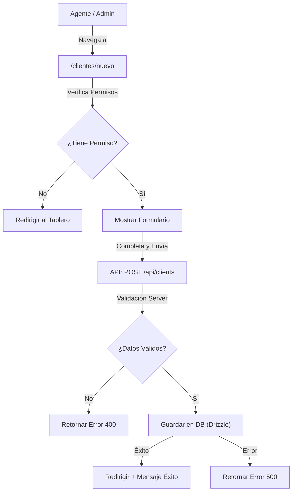

# Implementation Plan: Gestión de Clientes (Agregar)

**Date**: 2025-12-27  
**Spec**: [specs/create-client/create-client-spec.md](specs/create-client/create-client-spec.md)

## Summary

Implementar la funcionalidad para agregar nuevos clientes al sistema inmobiliario. Esto incluye la creación del esquema de base de datos, la API route para el procesamiento de datos, y el formulario de interfaz de usuario con validaciones y control de acceso.

## Architecture

## Technical Context

- **Storage**: PostgreSQL con Drizzle ORM.
- **UI Components**: shadcn/ui (Input, Select, Button, Card, Form).
- **Validation**: Zod (para validación en cliente y servidor).
- **Auth**: Better Auth para control de roles.

## Phase 1: Database Schema & Permissions - Priority: P1

**Goal**: Definir la tabla de clientes y los permisos necesarios.

### Implementation

- [ ] **T001 [P1]** Crear esquema de base de datos en `src/db/schema/client.ts`:
  - Tabla `client` con campos: `id` (text primary key), `nombre` (text not null), `apellido` (text not null), `tipo` (text not null), `telefono` (text), `dni` (text), `email` (text), `dueño_de` (text), `alquila` (text), `creado_por` (text reference user.id), `createdAt` (timestamp default now), `updatedAt` (timestamp default now).
- [ ] **T002 [P1]** Exportar el esquema en `src/db/schema/index.ts`.
- [ ] **T003 [P1]** Definir permisos en `src/lib/permissions.ts`:
  - Agregar `CLIENT_MANAGEMENT_PERMISSIONS = ["agent", "account_admin"]`.
  - Crear función `canManageClients(role)`.
- [ ] **T004 [P1]** Ejecutar migraciones: `bun run db:generate` y `bun run db:migrate`.

## Phase 2: API Route - Priority: P1

**Goal**: Crear el endpoint para procesar la creación de clientes.

### Implementation

- [ ] **T005 [P1]** Crear API route `src/app/api/clients/route.ts`:
  - Validar sesión y rol del usuario.
  - Validar datos recibidos con Zod.
  - Insertar cliente en la base de datos asignando `creado_por`.

## Phase 3: UI & Form - Priority: P1

**Goal**: Crear la interfaz de usuario para agregar clientes.

### Implementation

- [ ] **T006 [P1]** Crear componente `src/components/clients/client-form.tsx`:
  - Formulario reactivo con `react-hook-form` y `zod`.
  - Select para el campo `tipo` con las opciones especificadas.
- [x] **T007 [P1]** Crear página `src/app/clientes/nuevo/page.tsx`:
  - Proteger la página con `canManageClients`.
  - Renderizar el formulario.
- [ ] **T008 [P2]** Actualizar la navegación en `src/lib/navigation/menu-config.ts` para incluir el link a "Clientes".

## Phase 4: Feedback & UX - Priority: P2

**Goal**: Mejorar la experiencia de usuario con mensajes de éxito y navegación.

### Implementation

- [ ] **T009 [P2]** Implementar toast de éxito al guardar.
- [ ] **T010 [P2]** Redirigir al listado de clientes (pendiente crear listado) o al tablero tras el éxito.

## Dependencies

- Requiere Phase 1 completada antes de Phase 2.
- Requiere API Route (Phase 2) antes de terminar el Formulario (Phase 3).

