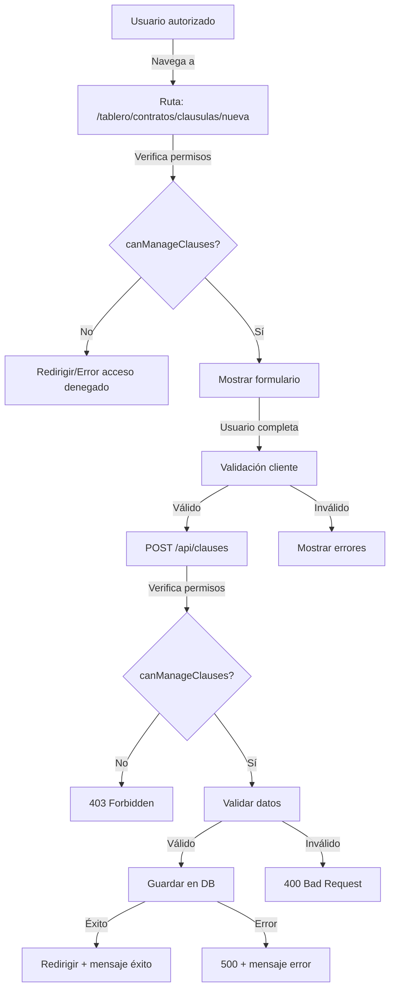

# Implementation Plan: Creación de Cláusulas de Contratos

**Date**: 2025-01-21  
**Spec**: [specs/create-contract-clause/create-contract-clause-spec.md](specs/create-contract-clause/create-contract-clause-spec.md)

## Summary

Implementar la funcionalidad completa para crear plantillas de cláusulas de contratos, permitiendo que usuarios autorizados (según `CLAUSE_MANAGEMENT_PERMISSIONS` en `src/lib/permissions.ts`) puedan crear nuevas plantillas de cláusulas reutilizables. La feature incluye esquema de base de datos, página protegida por permisos, formulario con validación completa, API route con verificación de permisos en dos capas, y componentes UI necesarios (Select y Textarea).

## Architecture



## Technical Context

**Language/Version**: TypeScript 5.x / Node.js  
**Primary Dependencies**:

- Next.js 16.0.7 (App Router)
- Drizzle ORM 0.45.1
- PostgreSQL (pg 8.16.3)
- React 19.2.0
- Better Auth 1.4.7 (para autenticación y permisos)
- shadcn/ui (para componentes UI)

**Storage**: PostgreSQL (configurado con Drizzle)  
**Testing**: Manual testing basado en escenarios de aceptación  
**Target Platform**: Web (Next.js App Router)  
**Project Type**: Web application (Next.js monorepo)  
**Performance Goals**:

- Formulario renderizado en <500ms (95th percentile)
- Creación de cláusula completada en <2s (90th percentile)
- Validación de formulario en <500ms (95th percentile)

**Constraints**:

- Verificación de permisos en dos capas (página y API)
- Validación de datos en cliente y servidor
- Límites de longitud: título 200 caracteres, contenido 50,000 caracteres
- Categorías predefinidas (no se pueden crear nuevas dinámicamente)
- Variables/placeholders en formato `{{variable_name}}` se almacenan tal cual

**Scale/Scope**:

- Múltiples usuarios pueden crear cláusulas
- Cada cláusula está asociada a su creador
- Sistema de permisos basado en roles (agent, account_admin)

## Project Structure

### Documentation

```
specs/create-contract-clause/
├── create-contract-clause-plan.md    # Este archivo
└── create-contract-clause-spec.md    # Especificación de la feature
```

### Source Code

```
src/
├── db/
│   └── schema/
│       ├── clause.ts                 # Esquema Drizzle para clauseTemplate
│       └── index.ts                  # Exportaciones (modificar)
├── app/
│   ├── api/
│   │   └── clauses/
│   │       └── route.ts              # API route POST para crear cláusulas
│   └── tablero/
│       └── contratos/
│           └── clausulas/
│               └── nueva/
│                   └── page.tsx      # Página de creación con verificación de permisos
├── components/
│   ├── clauses/
│   │   └── create-clause-form.tsx   # Formulario de creación
│   └── ui/
│       ├── select.tsx                # Componente Select (shadcn/ui)
│       └── textarea.tsx              # Componente Textarea (shadcn/ui)
├── lib/
│   ├── clauses/
│   │   └── constants.ts             # Constantes (categorías, límites)
│   └── permissions.ts                # Funciones de permisos (ya existe)
└── middleware.ts                     # Middleware (opcional: agregar verificación)
```

## Phase 1: Database Schema & Constants - Priority: P1

**Goal**: Crear el esquema de base de datos para almacenar plantillas de cláusulas y definir las constantes necesarias (categorías predefinidas y límites de longitud).

**Independent Test**: Verificar que la migración se genera correctamente y que las constantes están disponibles para importar.

### Implementation

- [ ] **T001 [P1] [US2]** Crear esquema de base de datos en [`src/db/schema/clause.ts`](src/db/schema/clause.ts):

  - Tabla `clauseTemplate` con campos: `id` (text, primary key), `title` (text, notNull, max 200), `category` (text, notNull), `content` (text, notNull, max 50,000), `creatorId` (text, notNull, referencia a `user.id` con `onDelete: "cascade"`), `createdAt` (timestamp, defaultNow), `updatedAt` (timestamp, defaultNow)
  - Relación many-to-one con `user` (muchas cláusulas por usuario)

- [ ] **T002 [P1] [US2]** Exportar el esquema en [`src/db/schema/index.ts`](src/db/schema/index.ts) agregando `export * from "./clause"`

- [ ] **T003 [P1] [US2]** Crear archivo de constantes [`src/lib/clauses/constants.ts`](src/lib/clauses/constants.ts):

  - Array `CLAUSE_CATEGORIES`: ["Pago", "Mantenimiento", "Terminación", "Obligaciones del Inquilino", "Obligaciones del Propietario", "General"]
  - `MAX_TITLE_LENGTH = 200`
  - `MAX_CONTENT_LENGTH = 50000`
  - Tipo `ClauseCategory` para TypeScript

- [ ] **T004 [P1] [US2]** Ejecutar `bun run db:generate` para generar migración
- [ ] **T005 [P1] [US2]** Revisar migración generada en `drizzle/` y verificar que la tabla `clauseTemplate` se crea correctamente
- [ ] **T006 [P1] [US2]** Ejecutar `bun run db:migrate` para aplicar la migración (o verificar que ya está aplicada)

**Checkpoint**: Esquema de base de datos creado, constantes definidas, y migración aplicada. La tabla `clauseTemplate` existe en la base de datos.

---

## Phase 2: UI Components (Select & Textarea) - Priority: P1

**Goal**: Crear los componentes UI necesarios (Select y Textarea) siguiendo el estilo de shadcn/ui y consistentes con otros componentes del proyecto.

**Independent Test**: Verificar que los componentes se pueden importar y renderizar correctamente con estilos consistentes.

### Implementation

- [ ] **T007 [P1] [US2]** Crear componente [`src/components/ui/select.tsx`](src/components/ui/select.tsx):

  - Usar `select` nativo de HTML con estilos consistentes
  - Soporte para `placeholder`, `disabled`, `required`
  - Estilos consistentes con otros componentes UI (Input, Button)
  - Soporte para `aria-invalid` para validación

- [ ] **T008 [P1] [US2]** Crear componente [`src/components/ui/textarea.tsx`](src/components/ui/textarea.tsx):
  - Usar `textarea` nativo de HTML con estilos consistentes
  - Soporte para `rows`, `maxLength`, `disabled`, `required`
  - Estilos consistentes con otros componentes UI
  - Soporte para `aria-invalid` para validación

**Checkpoint**: Componentes Select y Textarea creados y disponibles para usar en el formulario.

---

## Phase 3: API Route - Priority: P1

**Goal**: Crear el endpoint API para crear cláusulas con verificación de permisos, validación de datos, y persistencia en base de datos.

**Independent Test**: Hacer una petición POST a `/api/clauses` con datos válidos y verificar que se crea la cláusula en la base de datos. Verificar que usuarios sin permisos reciben 403.

### Implementation

- [ ] **T009 [P1] [US2]** Crear API route [`src/app/api/clauses/route.ts`](src/app/api/clauses/route.ts):
  - POST handler que obtiene sesión con `auth.api.getSession()`
  - Verificar permisos con `canManageClauses(session.user.role)`
  - Si no autorizado: retornar 403 Forbidden
  - Validar body: `title` (string, requerido, max 200), `category` (string, requerido, debe estar en `CLAUSE_CATEGORIES`), `content` (string, requerido, max 50,000)
  - Validar límites de longitud
  - Insertar en base de datos usando Drizzle con `creatorId` del usuario autenticado
  - Retornar 201 Created con datos de la cláusula creada
  - Manejar errores y retornar códigos apropiados (400, 403, 500)

**Checkpoint**: API route funcional. Usuarios autorizados pueden crear cláusulas, usuarios no autorizados reciben 403. Validación de datos funciona correctamente.

---

## Phase 4: Create Clause Form Component - Priority: P1

**Goal**: Crear el componente de formulario con validación completa, manejo de estados, y envío a la API.

**Independent Test**: Completar el formulario con datos válidos y verificar que se envía correctamente a la API. Probar validación de campos requeridos y límites de longitud.

### Implementation

- [ ] **T010 [P1] [US2]** Crear componente [`src/components/clauses/create-clause-form.tsx`](src/components/clauses/create-clause-form.tsx):
  - Campos: Título (Input, requerido, max 200), Categoría (Select, requerido, opciones de `CLAUSE_CATEGORIES`), Contenido (Textarea, requerido, max 50,000)
  - Estados: `isLoading`, `error` (errores generales), `fieldErrors` (errores por campo)
  - Validación: campos requeridos, límites de longitud, categoría válida
  - Mensajes de error específicos por campo
  - Manejo de envío: validar antes de enviar, POST a `/api/clauses`, mostrar mensaje de éxito y redirigir a `/tablero` con parámetro `success=clause_created`, preservar datos en caso de error de validación
  - Contadores de caracteres para título y contenido
  - Botones: "Crear Cláusula" (submit) y "Cancelar" (redirigir a `/tablero/contratos`)

**Checkpoint**: Formulario funcional con validación completa. Los datos se envían correctamente a la API y se manejan los errores apropiadamente.

---

## Phase 5: Create Clause Page - Priority: P1

**Goal**: Crear la página protegida por permisos que muestra el formulario de creación de cláusulas.

**Independent Test**: Navegar a `/tablero/contratos/clausulas/nueva` con un usuario autorizado y verificar que se muestra el formulario. Navegar con un usuario no autorizado y verificar que se redirige.

### Implementation

- [ ] **T011 [P1] [US1]** Crear página [`src/app/tablero/contratos/clausulas/nueva/page.tsx`](src/app/tablero/contratos/clausulas/nueva/page.tsx):
  - Server Component que obtiene sesión con `auth.api.getSession()`
  - Verificar permisos con `canManageClauses(session.user.role)`
  - Si no tiene permisos: redirigir a `/tablero`
  - Si tiene permisos: renderizar `DashboardLayout` con `CreateClauseForm`
  - Forzar renderizado dinámico: `export const dynamic = 'force-dynamic'`
  - Título y descripción de la página

**Checkpoint**: Página funcional. Usuarios autorizados ven el formulario, usuarios no autorizados son redirigidos.

---

## Phase 6: Success Message Display - Priority: P2

**Goal**: Mostrar mensaje de éxito en la página del tablero después de crear una cláusula exitosamente.

**Independent Test**: Crear una cláusula y verificar que después de la redirección se muestra el mensaje de éxito en el tablero.

### Implementation

- [ ] **T012 [P2] [US2]** Modificar [`src/app/tablero/page.tsx`](src/app/tablero/page.tsx):
  - Leer `searchParams` para detectar `success=clause_created`
  - Mostrar mensaje de éxito cuando el parámetro está presente
  - Usar estilos consistentes con otros mensajes del sistema

**Checkpoint**: Mensaje de éxito se muestra correctamente después de crear una cláusula.

---

## Dependencies & Execution Order

### Phase Dependencies

- **Phase 1 (Database Schema & Constants)**: No dependencies - puede empezar inmediatamente
- **Phase 2 (UI Components)**: No dependencies - puede empezar en paralelo con Phase 1
- **Phase 3 (API Route)**: Depende de Phase 1 (necesita esquema y constantes)
- **Phase 4 (Form Component)**: Depende de Phase 2 (necesita Select y Textarea) y Phase 3 (necesita API route)
- **Phase 5 (Page)**: Depende de Phase 4 (necesita el formulario)
- **Phase 6 (Success Message)**: Depende de Phase 4 (necesita que el formulario redirija correctamente)

### User Story Dependencies

- **User Story 1 (P1) - Acceso a Creación**: Implementado en Phase 5
- **User Story 2 (P1) - Crear Nueva Plantilla**: Implementado en Phases 1-4
- **User Story 3 (P2) - Seleccionar Categoría**: Implementado en Phase 4 (Select component)

### Within Each Phase

- Database schema antes de API route
- UI components antes de form component
- API route antes de form component
- Form component antes de page
- Core implementation antes de success message

## Notes

- El menú ya está configurado en `src/lib/navigation/menu-config.ts` (línea 92) con el item "Cláusulas" que apunta a `/tablero/contratos/clausulas/nueva`
- Los permisos ya están definidos en `src/lib/permissions.ts` con `CLAUSE_MANAGEMENT_PERMISSIONS` y función `canManageClauses()`
- La verificación de permisos en el middleware es opcional ya que se verifica en la página y en la API
- Las variables/placeholders en formato `{{variable_name}}` se almacenan tal cual sin procesamiento (el procesamiento será en una feature futura)
- Se permite duplicar títulos de cláusulas (diferentes usuarios pueden crear cláusulas con el mismo título)
