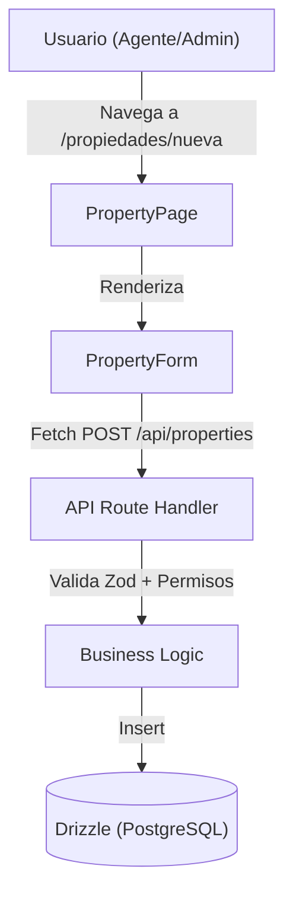

# Implementation Plan: Creación de Propiedades

**Date**: 2025-12-27
**Spec**: [specs/create-property/create-property-spec.md](specs/create-property/create-property-spec.md)

## Summary

Implementación de la funcionalidad para registrar nuevas propiedades en el sistema. Se desarrollará un formulario web para agentes inmobiliarios que permita capturar datos básicos y detalles técnicos, asociando cada propiedad a un cliente dueño. El backend utilizará Drizzle ORM para la persistencia y validación con Zod.

## Architecture



## Technical Context

**Language/Version**: Next.js 15+ (App Router), TypeScript
**Primary Dependencies**: Drizzle ORM, Zod, Better Auth, Shadcn UI
**Storage**: PostgreSQL
**Testing**: Manual integration testing via browser
**Project Type**: Web Application

## Project Structure

### Documentation (this feature)

```text
specs/create-property/
├── create-property-plan.md              # Este archivo
└── create-property-spec.md              # Especificación funcional
```

### Source Code

```text
src/
├── db/
│   └── schema/
│       ├── property.ts  # Nueva tabla de propiedades
│       └── index.ts     # Exportar nuevo esquema
    ├── app/
    │   ├── api/
    │   │   └── properties/
    │   │       └── route.ts # Endpoint de creación
    │   └── propiedades/
    │       └── nueva/
    │           └── page.tsx # Página de creación
├── components/
│   └── properties/
│       └── property-form.tsx # Formulario de creación
├── lib/
│   ├── permissions.ts   # Actualizar permisos
│   └── navigation/
│       └── menu-config.ts # Actualizar menú
```

## Phase 1: Foundational (Database & Permissions)

**Purpose**: Preparar la infraestructura de datos y seguridad.

- [ ] T001 Definir el esquema de la tabla `property` en `src/db/schema/property.ts` incluyendo relaciones con `client` y `user`.
- [ ] T002 Exportar el nuevo esquema en `src/db/schema/index.ts`.
- [ ] T003 Definir permisos `PROPERTY_MANAGEMENT_PERMISSIONS` y función `canManageProperties` en `src/lib/permissions.ts`.
- [ ] T004 Actualizar `hasRouteAccess` para incluir las nuevas rutas de propiedades.

## Phase 2: Backend (API Layer)

**Purpose**: Implementar la lógica de servidor para la creación.

- [ ] T005 Crear esquema de validación Zod para propiedades.
- [ ] T006 Implementar `POST` handler en `src/app/api/properties/route.ts` con verificación de sesión y permisos.
- [ ] T007 Manejar errores de base de datos y validación devolviendo códigos de estado apropiados.

## Phase 3: Frontend (UI & Integration)

**Purpose**: Crear la interfaz de usuario y conectar con la API.

- [ ] T008 Crear componente `PropertyForm` en `src/components/properties/property-form.tsx` usando Shadcn UI.
- [ ] T009 Implementar selector de clientes (dueños) dentro del formulario (puede requerir un endpoint de búsqueda de clientes si no existe).
- [x] T010 Implementar la página de creación en `src/app/propiedades/nueva/page.tsx` con protección de ruta.
- [ ] T011 Actualizar `src/lib/navigation/menu-config.ts` para mostrar el acceso a "Agregar propiedad" en el sidebar.

## Phase 4: Polish & Testing

**Purpose**: Refinar la experiencia de usuario.

- [ ] T012 Agregar mensajes de éxito/error (Toast) al finalizar la creación.
- [ ] T013 Verificar redirección automática tras creación exitosa.
- [ ] T014 Validar que solo usuarios con rol `agent` o `account_admin` vean el menú y puedan acceder a la ruta.

## Dependencies & Execution Order

1. **Phase 1** es prerrequisito para todas las demás (bloqueante).
2. **Phase 2** puede desarrollarse en paralelo con el diseño inicial del formulario, pero es necesaria para la integración final.
3. **Phase 3** depende de que los permisos y la API estén listos.
4. **Phase 4** se realiza una vez completado el flujo básico.
