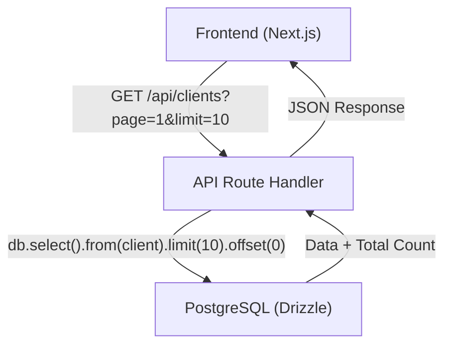

# Implementation Plan: List Clients

**Date**: 2025-12-27
**Spec**: `specs/list-clients/spec.md`

## Summary

Implement a paginated client list using shadcn/ui `Table` and `Pagination` components. The backend will handle pagination using Drizzle's `limit` and `offset`.

## Architecture



## Technical Context

**Language/Version**: TypeScript / Next.js 15+ (App Router)
**Primary Dependencies**: shadcn/ui, Drizzle ORM, Lucide React
**Storage**: PostgreSQL
**Testing**: Manual verification of pagination and data display

## Project Structure

### Documentation

```text
specs/list-clients/
├── plan.md              # This file 
└── spec.md             # Feature specification
```

### Source Code

```text
src/
├── app/
│   ├── api/
│   │   └── clients/
│   │       └── route.ts  # Add GET handler
│   └── clientes/
│       └── page.tsx  # Clients list page
├── components/
│   └── clients/
│       ├── client-table.tsx  # Table component
│       └── client-pagination.tsx # Pagination component (or use shadcn directly)
└── lib/
    └── clients/
        └── actions.ts (Optional: if using Server Actions instead of API)
```

## Phase 1: Setup

- [x] T001 Install shadcn/ui components: `table`, `pagination`, `badge`.
- [x] T002 Create directory `specs/list-clients/`.

## Phase 2: Backend Implementation

- [ ] T003 Implement `GET` handler in `src/app/api/clients/route.ts` with pagination support.
- [ ] T004 Add total count calculation to the API response.
- [ ] T005 Validate user session and permissions in the `GET` handler.

## Phase 3: Frontend Implementation (P1)

- [x] T006 Create the clients list page at `src/app/clientes/page.tsx`.
- [ ] T007 Implement the `ClientTable` component using shadcn `Table`.
- [ ] T008 Implement pagination logic in the frontend using shadcn `Pagination`.
- [ ] T009 Integrate table and pagination with the API.

## Phase 4: Polish & Refinement

- [ ] T010 Add loading states (skeletons).
- [ ] T011 Handle empty states and error states gracefully.
- [x] T012 Add a "New Client" button in the header (linking to `/clientes/nuevo`).

## Dependencies & Execution Order

1. **Setup**: Install components.
2. **Backend**: Update API route.
3. **Frontend**: Build UI and connect to API.

