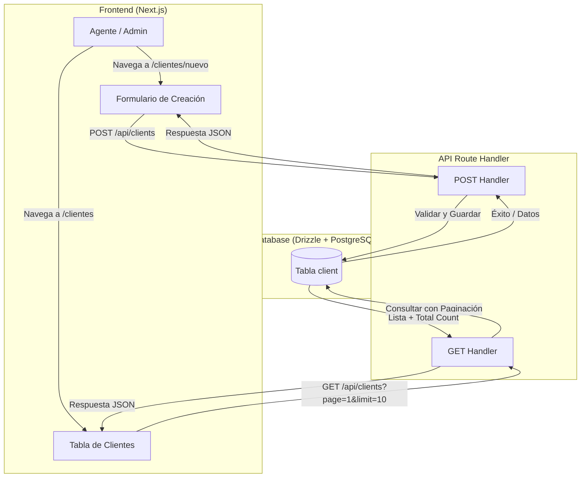

# Implementation Plan: Gestión de Clientes

**Date**: 2025-12-28
**Spec**: [specs/manage-clients/manage-clients-spec.md](specs/manage-clients/manage-clients-spec.md)
**Unified from**: `specs/create-client/` and `specs/list-clients/`

## Summary

Implementar la funcionalidad completa para la gestión de clientes en el sistema inmobiliario, incluyendo la creación de nuevos registros y la visualización de una lista paginada. Esto abarca el esquema de base de datos, los endpoints de la API (GET/POST), y la interfaz de usuario con componentes de shadcn/ui.

## Architecture



## Technical Context

- **Storage**: PostgreSQL con Drizzle ORM.
- **UI Components**: shadcn/ui (Table, Pagination, Input, Select, Button, Card, Form, Badge).
- **Validation**: Zod (para validación en cliente y servidor).
- **Auth**: Better Auth para control de roles y permisos.

## Project Structure (Relevant Paths)

```text
src/
├── app/
│   ├── api/
│   │   └── clients/
│   │       └── route.ts  # Manejadores GET y POST
│   └── clientes/
│       ├── page.tsx      # Listado de clientes
│       └── nuevo/
│           └── page.tsx  # Formulario de nuevo cliente
├── components/
│   └── clients/
│       ├── client-form.tsx      # Formulario de creación
│       ├── client-table.tsx     # Tabla de listado
│       └── client-pagination.tsx # Controles de paginación
└── db/
    └── schema/
        └── client.ts     # Definición de la tabla
```

## Phase 1: Database Schema & Permissions - Priority: P1

**Goal**: Definir la persistencia y el control de acceso.

- [x] **T001 [P1]** Crear esquema de base de datos en `src/db/schema/client.ts`.
- [x] **T002 [P1]** Exportar el esquema en `src/db/schema/index.ts`.
- [x] **T003 [P1]** Definir permisos en `src/lib/permissions.ts` (`CLIENT_MANAGEMENT_PERMISSIONS = ["agent", "account_admin"]`).
- [x] **T004 [P1]** Ejecutar migraciones (`db:generate` y `db:migrate`).

## Phase 2: Backend Implementation (API) - Priority: P1

**Goal**: Proveer los servicios de datos para el listado y la creación.

- [x] **T005 [P1]** Implementar `POST` handler en `src/app/api/clients/route.ts` con validación Zod y sesión.
- [x] **T006 [P1]** Implementar `GET` handler en `src/app/api/clients/route.ts` con soporte para paginación (`limit`, `offset`) y conteo total.

## Phase 3: UI Implementation - Creation (P1)

**Goal**: Permitir la entrada de nuevos clientes.

- [x] **T007 [P1]** Crear componente `src/components/clients/client-form.tsx` con `react-hook-form` y `zod`.
- [x] **T008 [P1]** Crear página `src/app/clientes/nuevo/page.tsx` protegida por permisos.
- [x] **T009 [P2]** Implementar feedback visual (toasts) tras la creación exitosa.

## Phase 4: UI Implementation - Listing & Pagination (P1)

**Goal**: Mostrar los clientes existentes de forma eficiente.

- [x] **T010 [P1]** Crear la página de listado en `src/app/clientes/page.tsx`.
- [x] **T011 [P1]** Implementar `ClientTable` utilizando shadcn `Table`.
- [x] **T012 [P1]** Implementar `ClientPagination` (o integrar directamente shadcn `Pagination`).
- [x] **T013 [P2]** Añadir estados de carga (skeletons) y manejo de estados vacíos.

## Phase 5: Navigation & Integration - Priority: P2

**Goal**: Unificar la experiencia de usuario.

- [x] **T014 [P2]** Actualizar la navegación en `src/lib/navigation/menu-config.ts` para incluir "Clientes".
- [x] **T015 [P2]** Asegurar que el botón "Nuevo Cliente" en el listado redirija correctamente.

## Dependencies

1. **Phase 1** debe preceder a **Phase 2**.
2. **Phase 2 (GET/POST)** debe estar lista para la integración final de las **Phases 3 y 4**.
