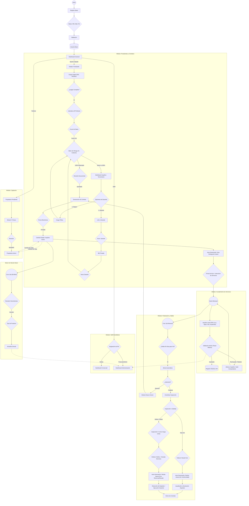

# Diagrama de Flujo del Sistema (Actualizado)

```mermaid
flowchart TB
    Start(("Inicio")) --> Reg["Registro Base"]
    Reg --> RegFields{"Datos: DNI, Mail, Tel"}
    RegFields --> Auth["Validación"]
    Auth --> DB_User[("Usuario Base")]
    DB_User --> Dash["Dashboard General"]

    %% -----------------------------------------
    %% MÓDULO ALQUILERES Y ONBOARDING (ACTUALIZADO)
    %% -----------------------------------------
    subgraph Modulo_Alquileres ["Módulo: Postulantes y Contratos"]
        Dash -->|Opción: Alquilar| Post["Estado: Postulante"]
        Post --> DocLoad["Carga Legajo (DNI, Recibos)"]
        
        DocLoad --> PreCheck{"¿Legajo Completo?"}
        PreCheck -- Sí --> API_Nosis{"Llamada a API (Nosis)"}
        API_Nosis --> CrossData{"Cruce de Datos"}
        
        CrossData -- "Score OK" --> RiskCalc{"Motor de Riesgo (% Cubierto)"}
        RiskCalc -- Menor a 100% --> ShowMeter["Dashboard Inquilino: Termómetro"]
        
        ShowMeter --> Options{"Opciones de Garantía"}
        Options -- 1. Garante --> GuarEmail["Link a Garante"] --> GuarData{"Form. Garante"} --> DB_Guar["BD Privada"] --> API_Nosis_Guar{"Veraz Garante"} --> RiskCalc
        Options -- 2. Seguro --> Deposit["Carga Póliza"] --> RiskCalc
        
        RiskCalc -- 100% Alcanzado --> AdminValDocs{"Revisión Documental"}
        AdminValDocs -- Aprobado --> ContractGen["Generación de Contrato"]
        ContractGen --> SignProcess{"Firma Electrónica"}
        
        %% Nuevo: Generación de Acta de Entrega
        SignProcess -- Firmado --> Tenant["Cambio Estado: Inquilino Activo"]
        Tenant --> HandoverDoc["Auto-Generación: Acta Entrega de Llaves"]
        HandoverDoc --> HandoverSign{"Firma de Acta + Instructivo de Servicios"}
    end

    %% -----------------------------------------
    %% MÓDULO CONTROL DE SERVICIOS (NUEVO BUCLE MENSUAL)
    %% -----------------------------------------
    subgraph Modulo_Servicios ["Módulo: Cumplimiento de Servicios"]
        HandoverSign --> MonthLoop(("Bucle Mensual"))
        MonthLoop --> TenantUploads["Inquilino sube PDFs (Luz, Agua, Gas, Expensas)"]
        TenantUploads --> AdminCheckServ{"Validación Admin (Panel Masivo)"}
        
        AdminCheckServ -- Aprobado --> LogCompliance[("Registro Histórico OK")]
        AdminCheckServ -- Rechazado / Faltante --> AlertTenantServ["Alerta a Inquilino: Subir Comprobante"]
        AlertTenantServ --> MonthLoop
    end

    %% -----------------------------------------
    %% MÓDULO DE RENOVACIÓN Y SALIDA (ACTUALIZADO CON ACTA)
    %% -----------------------------------------
    subgraph Modulo_Renovacion ["Módulo: Finalización y Salida"]
        MonthLoop --> CronJob2(("Cron Job Mensual"))
        CronJob2 --> CheckEnd{"¿Faltan 60 días para Vto?"}
        CheckEnd -- Sí --> AlertAll["Alerta Automática"]
        
        AlertAll --> Intent{"¿Intención?"}
        Intent -- Renovar --> CalcNewRent["Cálculo Nuevo Canon"] --> ContractGen
        
        Intent -- Finalizar --> InspCoord["Coordinar Inspección"]
        InspCoord --> Insp1{"Inspección 1 (Salida)"}
        
        Insp1 -- Todo OK --> NoDebt{"Cálculo: Deuda Cero"} 
        Insp1 -- Daños / Faltas --> Insp2{"Inspección 2+ (Con Cargo extra)"}
        Insp2 --> DebtCalc{"Cálculo: Daños + Deudas Servicios"}
        
        %% Nuevo: Generación de Acta de Recepción
        NoDebt --> HandbackDocOK["Auto-Generación: Recibo Llaves (En Conformidad)"]
        DebtCalc --> HandbackDocDebt["Auto-Generación: Recibo Llaves (Con Reservas/Deuda)"]
        
        HandbackDocOK --> Refund["Liquidación y Devolución Depósito"] --> EndContract["Cierre de Contrato"]
        HandbackDocDebt --> Retain["Retención de Depósito / Ejecución Garantía"] --> EndContract
    end

    %% -----------------------------------------
    %% MÓDULO FINANCIERO Y MORA (Resumido para espacio)
    %% -----------------------------------------
    subgraph Motor_Financiero ["Motor de Cálculo Diario"]
        Tenant --> CronJob(("Cron Job (00:00hs)")) --> CheckDue{"Revisión Vencimientos"}
        CheckDue -- Vencido --> CalcType{"Tipo de Punitorio"}
        CalcType --> GenerateDebt["Actualiza Deuda"]
    end

    %% -----------------------------------------
    %% MÓDULO CAPTACIÓN (Resumido para espacio)
    %% -----------------------------------------
    subgraph Modulo_Captacion ["Módulo: Captación"]
        Dash -->|Publicar| OwnerPending["Propietario Pendiente"] --> WizardStart["Wizard: 5 Pasos"] --> PropVal{"Revisión"} -- Aprobado --> OwnerActive["Propietario Activo"]
    end

    %% -----------------------------------------
    %% MÓDULO STAFF / ADMIN
    %% -----------------------------------------
    subgraph Modulo_Interno ["Módulo: Staff Inmobiliaria"]
        Dash -->|Staff| StaffRole{"Asignación de Rol"}
        StaffRole -- Ventas --> DashVentas["Dashboard Comercial"]
        StaffRole -- Finanzas/Admin --> DashAdmin["Dashboard Administración"]
        
        GenerateDebt -.-> DashAdmin
        AdminCheckServ -.-> DashAdmin
    end

    %% Swicheo de perfiles
    Tenant -. "Cambio de Vista" .-> OwnerActive
    OwnerActive -. "Cambio de Vista" .-> Tenant
```
